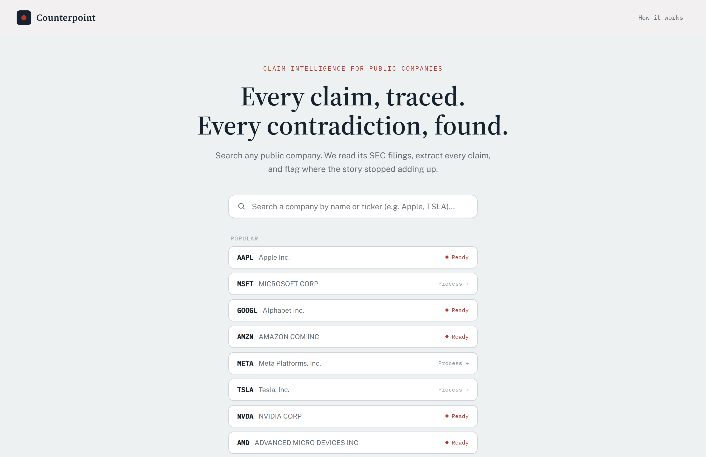
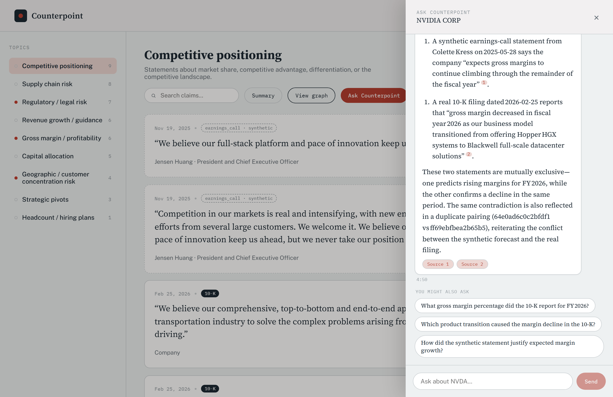
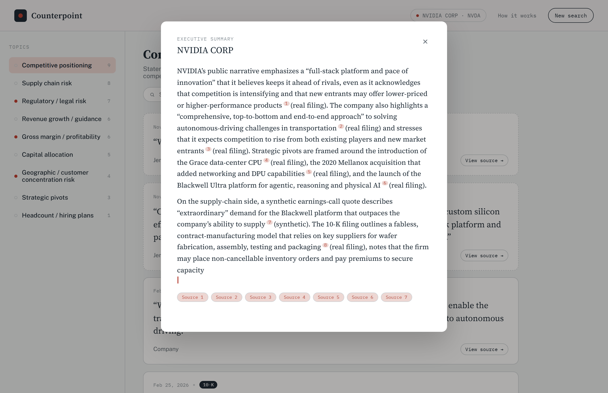
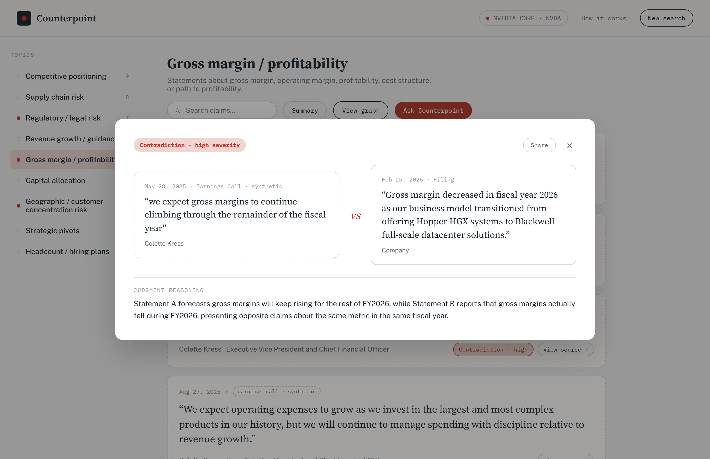
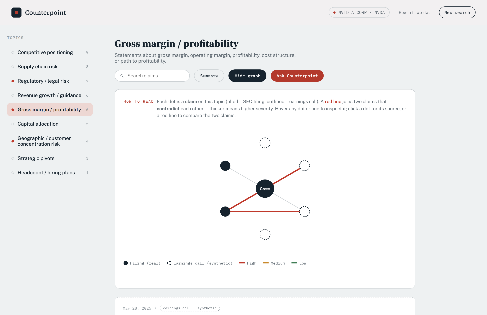
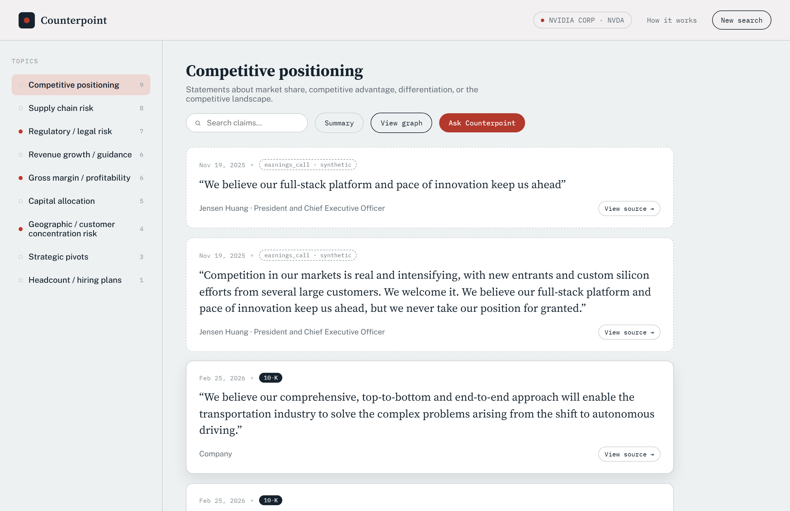
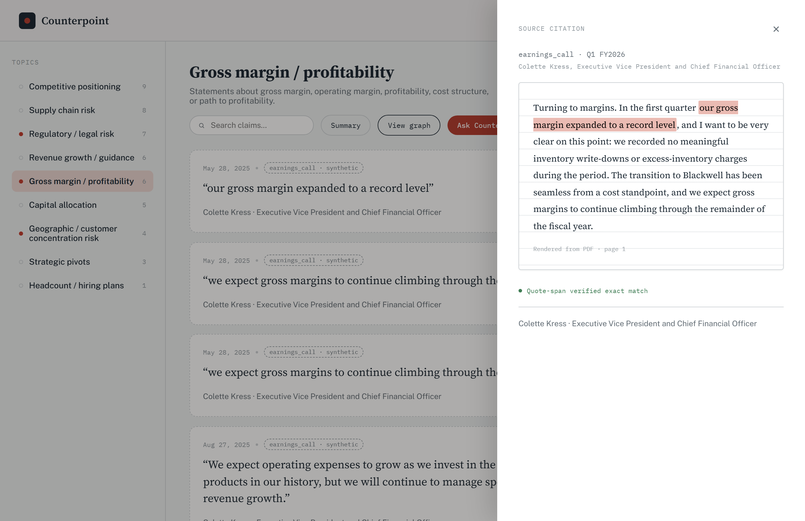

# Counterpoint — Corporate Contradiction Detector


Ingests a company's public SEC filings (10-K / 10-Q / 8-K), extracts every factual
and strategic claim made by named speakers, builds a knowledge graph of those claims,
detects **contradictions across time** (graph traversal + LLM judgment), and surfaces
them through a searchable UI where **every claim traces back to a verbatim quote in its
source document**.

> **Data honesty.** SEC filings are **real**. For the NVIDIA demo, the earnings-call
> excerpts are **synthetic** — clearly tagged everywhere, and deliberately seeded with a
> few planted contradictions to demonstrate detection. Any company processed live uses
> **only real filings**, so its contradictions (if any) are genuine.

---

## What it does

- **Search & process any public company.** Search the full SEC universe; NVDA is
  pre-loaded, any other company is processed **live on demand** (ingest → extract →
  graph → index → detect) with a staged progress screen.
- **Claim timeline** per topic, with real vs synthetic clearly distinguished.
- **Contradiction graph** — an interactive hub-and-spoke view; contradiction edges are
  colored/weighted by severity.
- **Book-page citations** — real filings render as styled HTML with the exact quote
  highlighted inline; synthetic docs render as the actual PDF page with a highlight.
- **Hybrid search** — semantic claim search (Qdrant) enriched with graph context.
- **Ask Counterpoint** — a grounded chat assistant (LangGraph orchestrator + tools)
  scoped to the currently-open company. Every assertion cites a retrieved claim;
  off-topic questions, other-company questions, investment advice, and prompt
  injection are all refused by layered guardrails. Answers stream token-by-token
  (SSE) and render as **Markdown** with inline footnote-style citations, each
  message is **timestamped**, and every turn ends with **contextual follow-up
  chips** you can click to keep digging. Starter-question chips seed the empty state.
- **Executive summary** — a one-click, streamed narrative of a company's key
  topics and detected contradictions, Markdown-rendered with the same inline
  citations as chat.
- **Considered motion design** — a purpose-built boot loader (a filing is scanned,
  two claims are traced in, a contradiction sparks), streaming carets, typing
  indicators, and smooth slide/scale transitions throughout — all respecting
  `prefers-reduced-motion`.
- **Shareable citation card** — a printable/exportable card for a contradiction's
  two verbatim quotes, reachable from the compare view.
- **Full observability** — every extraction/judgment/chat LLM call is traced in Langfuse.

## Screenshots

Search any public company, then trace every claim back to its source.



| Ask Counterpoint — grounded chat | Executive summary |
| --- | --- |
|  |  |

| Contradiction compare | Contradiction graph |
| --- | --- |
|  |  |

| Claim timeline | Book-page citation |
| --- | --- |
|  |  |

## Architecture

```
EDGAR filings (real) ┐
                     ├─▶ parse ─▶ extract claims ─▶ Neo4j graph ┐
synthetic PDFs ──────┘  (BS4 /    (LLM + verbatim   + Qdrant     ├─▶ detect ─▶ FastAPI ─▶ React UI
                        PyMuPDF)   quote guardrail)   vectors    ┘  (graph +    (citations,
                                                                     LLM judge)   graph, search)
```

| Layer | Tech |
| ----- | ---- |
| Backend | Python, FastAPI |
| Graph DB | **Neo4j Aura** (cloud; Desktop also works) |
| Vector DB | **Qdrant Cloud** (self-host also works) |
| Embeddings | **FastEmbed** (ONNX, CPU, no torch) |
| LLM | **Ollama Cloud `gpt-oss:120b`** for extraction + judgment + chat orchestration/synthesis, **`gpt-oss:20b`** for the fast chat guardrail (config-driven; a Gemini/Vertex path is included) |
| Chat | **LangGraph** supervisor-orchestrator graph (`chatbot/`), streamed over SSE |
| Parsing | `edgartools` + BeautifulSoup (EDGAR HTML), PyMuPDF (synthetic PDFs) |
| Frontend | React + Vite (custom SVG graph + citation viewer) |
| Observability | **Langfuse Cloud** |

Model IDs, the topic list, DB connections, and processing bounds all live in
[`config/`](config/) and are **never hardcoded** in pipeline code.

### Retrieval design (RAG)

"Ask Counterpoint" is **agentic, hybrid, grounding-verified RAG** — not naive
retrieve-then-generate:

- **Agentic.** A LangGraph orchestrator (`gpt-oss:120b`) runs a ReAct-style loop,
  choosing *which* retrieval tool to call and *when* (bounded by
  `max_tool_iterations`), then hands off to a separate synthesizer — see
  [`chatbot/tools.py`](chatbot/tools.py) and [`chatbot/graph.py`](chatbot/graph.py).
- **Hybrid.** Two retrieval modalities the agent picks between: **semantic/dense**
  (`semantic_search` → FastEmbed `bge-small-en-v1.5` → Qdrant ANN) and
  **structured / GraphRAG** (topic timelines, contradictions, speakers, citations
  → Neo4j Cypher).
- **Scoped.** Every tool is closed over one `ticker`, so retrieval is hard-filtered
  to the open company — the model cannot query another.
- **Grounding-verified.** Tools return `content_and_artifact`; the output guardrail
  checks that every claim the answer cites was actually retrieved, regenerating once
  or falling back to "not in the filings". This is the quote-span honesty guarantee
  extended to conversation.

The **executive summary** uses a simpler single-shot grounded variant (gather top
topics/contradictions → one synthesis call), sharing the same citation convention.

### Graph data model (Neo4j)

```
(Speaker)-[:MADE]->(Claim)-[:APPEARS_IN]->(Document)-[:FILED_BY]->(Company)
(Claim)-[:ABOUT]->(Topic)
(Claim)-[:CONTRADICTS {severity, reasoning, judged_at}]->(Claim)
```

Every `Claim` carries a `quote_span` (verified verbatim), a `position_anchor`
(document#section#paragraph), and — for synthetic PDFs — `page`/`bbox` for highlighting.

---

## Setup

### Prerequisites
- **Python 3.11+**, **Node 18+**
- Free cloud accounts: **Neo4j Aura**, **Qdrant Cloud**, **Ollama Cloud**; optional
  **Langfuse Cloud** (tracing) and **Google Vertex AI** (alternate LLM).

### 1. Python env + deps
```bash
python -m venv .venv
# Windows PowerShell: .venv\Scripts\Activate.ps1   | macOS/Linux: source .venv/bin/activate
pip install -r requirements.txt
```

### 2. Environment
```bash
cp .env.example .env      # then fill in — see .env.example for every key
```
Required: `EDGAR_IDENTITY` (name + email for SEC), `OLLAMA_HOST`/`OLLAMA_API_KEY`,
`NEO4J_URI`/`NEO4J_USER`/`NEO4J_PASSWORD`/`NEO4J_DATABASE`, `QDRANT_URL`/`QDRANT_API_KEY`.
Optional: `LANGFUSE_*` (tracing is a no-op without them).

> Aura note: some instances use the **instance id** as both username and database name
> (e.g. `NEO4J_USER=38bcb6ce`, `NEO4J_DATABASE=38bcb6ce`) rather than `neo4j`.

### 3. Frontend deps
```bash
npm install --prefix frontend
```

---

## Running

### Backend API + frontend
```bash
.venv/Scripts/uvicorn api.app:app --port 8000     # API  -> http://localhost:8000/docs
npm run dev --prefix frontend                      # UI   -> http://localhost:5173
```

Open the UI, search a company, and go. See [DEMO.md](DEMO.md) for the rehearsed path.

### Bootstrapping the NVDA demo data (offline pipeline)
The pre-loaded NVDA corpus (with synthetic transcripts + planted contradictions) is built
by the CLI pipeline. To rebuild it from scratch:
```bash
python -m ingestion.run_ingest                                  # fetch + parse NVDA filings
python -m ingestion.run_synthetic                               # generate + parse synthetic PDFs
python -m extraction.run_extract                                # extract claims (LLM + guardrail)
python -m extraction.run_extract --contains "Gross margin decreased" \
                                 --contains "limited number of partners"   # demo anchors
python -m graph.run_load --reset                                # load the graph
python -m vector.run_index                                      # index for search
python -m detection.run_detect                                  # detect contradictions
python -m ingestion.company_universe                            # (optional) refresh recent-filers cache
```

### Live processing (any company)
Selecting an unprocessed company in the UI runs the same pipeline via a background job with
a live progress screen. **A run takes ~3–5 minutes** (measured ~4 min end-to-end for a
mid-cap: ~35s fetching, ~2 min extraction, ~1 min graph/index/detect) on the Ollama free
tier — roughly a coffee run. Bounds are in
[`config/processing.yaml`](config/processing.yaml) (default: 1×10-K + 2×10-Q, 10 chunks/doc,
15 detection pairs); raise them for deeper coverage at the cost of time.

---

## API (selected endpoints)

| Endpoint | Purpose |
| --- | --- |
| `GET /companies` | Processed companies |
| `GET /company-search?q=` · `/popular` · `/recent` | SEC company discovery |
| `POST /companies/{ticker}/process` → `GET /jobs/{id}` | Start + poll a live processing job |
| `GET /companies/{ticker}/topics` | Topics with claim counts |
| `GET /topics/{id}/claims?ticker=` | Claim timeline for a topic |
| `GET /contradictions?ticker=&min_severity=` | Confirmed contradictions |
| `GET /claims/{id}/citation` · `/page.png` | Source citation (HTML data or PDF page) |
| `GET /search?q=&ticker=` | Hybrid semantic + graph search |
| `POST /companies/{ticker}/chat` | Ask Counterpoint — SSE stream of a grounded chat turn |
| `GET /companies/{ticker}/chat/suggestions` | Starter questions for the open company |
| `POST /companies/{ticker}/chat/followups` | Contextual follow-up questions for the last turn |
| `GET /companies/{ticker}/summary` | SSE stream of a grounded executive summary |
| `GET /system/info` | Live model/config info for the "technical detail" How-It-Works view |

Full interactive docs at `/docs`.

## Observability

With `LANGFUSE_*` set, every extraction (`extract-claims`) and judgment
(`judge-contradiction`) call is a Langfuse **generation** — model, prompt, output,
latency, token usage — grouped under one **trace per pipeline run**. Without keys it's a
silent no-op. Wiring lives in [`observability/`](observability/) and wraps
`extraction/providers.py` + `detection/judge.py`.

## Project structure

```
ingestion/     EDGAR fetch + HTML/PDF parsing; synthetic transcripts; company universe
extraction/    LLM claim extraction + quote-span guardrail (provider-agnostic)
graph/         Neo4j schema, loaders, queries
detection/     candidate-pair Cypher + LLM contradiction judgment
vector/        FastEmbed + Qdrant hybrid search
pipeline/      on-demand company-processing orchestrator
observability/ Langfuse tracing (no-op fallback)
chatbot/       LangGraph chat agent — tools, guardrails, orchestrator/synthesis graph
api/           FastAPI app + background job registry + citation builder + chat router
frontend/      React + Vite app (Counterpoint)
config/        topics, model/provider config, DB connections, processing bounds, chat guardrails
tests/         63 tests (config, ingestion, extraction, graph, detection, api, processing, chatbot)
```

## Testing
```bash
.venv/Scripts/python -m pytest tests/ -q      # 63 tests, network-free
```

## Deploy (GCP free tier)

The whole app deploys as **one Cloud Run container** — FastAPI serves both the API
and the built React SPA (same origin, no CORS). The heavy state stays on its
existing managed free tiers (Neo4j Aura, Qdrant Cloud, Ollama Cloud). Cloud Build
builds the image from the [`Dockerfile`](Dockerfile), so no local Docker is needed.

**First deploy** (sets env from `.env`; `--env-vars-file` handles secrets cleanly):
```bash
gcloud config set project corporate-contradict-detector
gcloud services enable run.googleapis.com cloudbuild.googleapis.com artifactregistry.googleapis.com
gcloud run deploy counterpoint-api --source . --region us-central1 --allow-unauthenticated \
  --no-cpu-throttling --min-instances=0 --max-instances=1 --concurrency=20 \
  --timeout=3600 --memory=2Gi --env-vars-file cloudrun-env.yaml
```
The flags matter: `--no-cpu-throttling` keeps the in-process background job
([`api/jobs.py`](api/jobs.py)) running between polls so **live processing works**;
`--max-instances=1 --concurrency=20` keep the in-memory job registry coherent;
`--min-instances=0` stays in the always-free tier (accepts a cold start).
`--memory=2Gi` is required: the largest 10-Ks (e.g. MSFT) are multi-MB of HTML,
and fetching + parsing one on top of the resident ML models exceeds 1 GiB — the
instance OOM-restarts mid-fetch, which wipes the in-memory job registry and makes
live processing hang at 5% (`GET /jobs/{id}` then 404s). 2 GiB stays free: at
`--min-instances=0`, memory-seconds only accrue while a job runs.

**Redeploy after changes:** re-run the same `gcloud run deploy --source .` command
— env vars/secrets already on the service are preserved. Pushing to GitHub does
**not** auto-deploy; to enable that, connect the repo as a Cloud Build trigger
(it will use [`cloudbuild.yaml`](cloudbuild.yaml)).

**Cost guard:** a Cloud Billing budget alerts by email at the first ~1% of any
spend (the deploy targets the always-free allowances, so expect ₹0).

## Honest notes & limitations
- **Curated topic list (9 topics), not open-ended.** Deliberate for a clean, controlled v1.
- **Synthetic data is NVDA-only** and clearly tagged; it exists to demonstrate detection.
  Live-processed companies are real-filings-only and may show few/zero contradictions.
- **Cost/latency.** Live processing is bounded to keep runs to a few minutes on free tiers;
  raise `config/processing.yaml` bounds for deeper coverage.
- **The quote-span guardrail is a hard constraint** — the entire citation feature and the
  project's credibility depend on it; claims that fail verbatim validation are dropped.

## License

[MIT](LICENSE) © Nisarg Kudgunti
